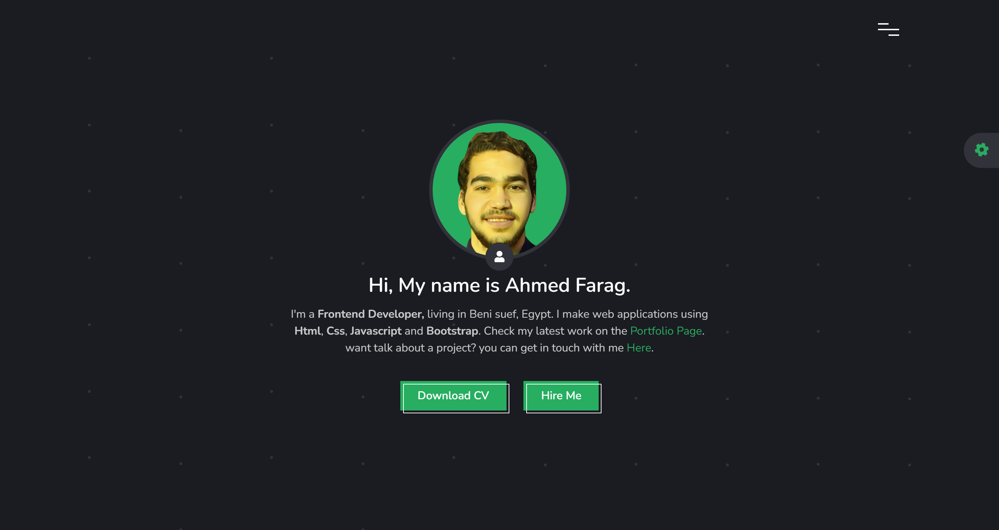

<!--## Contact Form Data Link https://docs.google.com/spreadsheets/d/1z4GuxWC0LWpEKml5BLOS-XYXLtzEE33HIb4b_2MIuaw/edit#gid=0*-->
# My Personal Portfolio Website

A sleek, custom-built portfolio website designed to showcase my work and skills. This project highlights my ability to create responsive, interactive web experiences using fundamental web technologies.



## Features

- **Responsive Design:** Optimized for various screen sizes and devices to ensure a seamless viewing experience.
- **Interactive Elements:** Utilizes JavaScript to add dynamic content and smooth animations.
- **Project Showcase:** Displays detailed sections to highlight key projects and technical skills.
- **Theme Showcase:** Toggle dark or light theme, Glass effect and Also change main color.
- **Contact Form:** Integrated form for visitors to get in touch.

## Technologies Used

- **HTML:** Structure of the web pages.
- **CSS:** Styling and layout of the website.
- **JavaScript:** Interactive elements and dynamic content.

## Installation

To view or modify the portfolio website locally:

1. **Clone the repository:**
   ```bash
   git clone https://github.com/AhmedFarag18/portfolio.git


### Live Preview:
https://ahmedfarag18.github.io/portfolio/
<br>
or
<br>
https://portfolio-blue-phi.vercel.app/


**Have fun building!** 🚀
